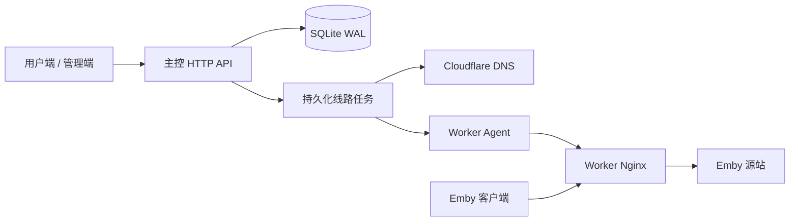

# Emby Edge Panel

面向几十至百来人社群的轻量 Emby 多节点反向代理管理工具。提供授权码注册、线路额度、固定域名入口、节点管理、源站修改、节点迁移和统一证书分发，支持小规格 VPS 主控与 NAT Worker。

v2 保留原有业务模型，重点重构并发控制、线路状态一致性和资源使用方式。主控采用 Python 3.12、Starlette、Uvicorn 和 SQLite WAL；前端使用原生 JavaScript，Worker 由 Python Agent 与 Nginx 组成。

[安装与部署](docs/deployment.md) · [版本说明](https://github.com/axixiansheng/emby-edge-panel/releases)

首次安装主控执行 `install-master.sh`，**直接部署新版 Docker 主控，不需要先安装旧版**；已有主控更新才使用 `deploy-docker.sh`。Worker 使用 `install-worker.sh` 部署原生服务，与主控分别安装。

## 架构

控制面负责账号、额度和配置；数据面负责实际 Emby 转发。视频流量不经过主控，主控短时不可用不会停止 Worker 已加载的转发规则。



| 层次 | 技术与职责 |
| --- | --- |
| 主控 HTTP | Starlette 路由、会话鉴权、输入检查与静态资源；阻塞业务在线程中执行 |
| 业务服务 | 注册、额度、任务状态机、节点健康和管理操作 |
| 存储 | SQLite WAL、短写事务、索引及活动任务唯一约束 |
| 外部通信 | Cloudflare DNS、Worker 签名请求、证书加密分发 |
| Worker | Python Agent 管理映射，Nginx 处理 HTTP/HTTPS、WebSocket 和 Range 转发 |
| 前端 | 用户端与管理端独立视图，原生 JavaScript、响应式布局、本地 Lucide 图标 |

## 核心优化

### 并发注册：缩小临界区，消除假排队

旧流程依赖浏览器票据与全局 POST 锁，无关请求或慢速外部调用会拖住注册。v2 将资源协调收敛到真正需要互斥的数据库写入：

- 不再以浏览器排队票据作为注册前置条件。
- 密码哈希在事务外计算，只有授权码兑换、用户创建和会话签发进入同一短事务。
- 条件更新确保一个授权码只能兑换一次；任一步失败，整个注册事务回退。
- 用户名在写事务内检查大小写冲突，避免多个并发请求绕过重复校验。
- 登录与普通接口使用独立的线程容量限制，慢密码计算不占满普通接口的执行资源。

这消除了票据状态和无关请求造成的假排队，但不意味着无限并发：密码计算仍有资源上限，突发请求会产生正常的容量等待。

### SQLite：保留轻量存储，改善读写协调

WAL 让读取不必与每次写入完全串行。进程内写锁仅覆盖短写事务，密码计算、DNS 和 Worker 通信不持有该锁；`BEGIN IMMEDIATE` 与超时设置进一步约束写入竞争。

主控保留一个 WAL 锚连接，避免短连接全部关闭时反复进行收尾检查点。线路、用户和任务索引服务于实际查询；活动任务使用部分唯一索引，保证同一线路不会同时执行两个变更。

SQLite 仍然是单写者数据库。设计目标是降低锁占用，而不是把它描述为支持无限并行写入的数据库。

### 线路任务：从同步调用改为可恢复状态机

线路创建、修改、迁移和删除先持久化任务，再由两个后台执行线程处理外部通信。接口返回 HTTP 202 和 `operation_id`，前端按任务结果展示状态。

| 阶段 | 行为 |
| --- | --- |
| `apply` | 保存 DNS 快照及执行标记；创建与更新先配置目标 Worker，再更新 DNS，删除则先撤销 DNS |
| `cleanup` | 线路记录与清理阶段原子提交；清理不再需要的旧映射 |
| `rollback` | 应用失败后按已触及的资源执行补偿，恢复原 DNS 和 Worker 配置 |

重启会恢复未完成任务；外部请求失败采用退避重试。应用阶段连续失败后进入补偿，清理失败则继续重试，不会把已经生效的新线路错误回退。

DNS、Worker 与 SQLite 无法组成一个原子事务，因此采用持久化检查点、幂等操作与补偿实现可恢复的一致性。这是可追踪的最终一致性流程，不是“只执行一次”的分布式事务保证。

### 修改与迁移：区分覆盖、切换和清理

同一 Worker 修改源站只覆盖该线路映射，不再执行会误删新配置的旧线路清理。

跨 Worker 迁移按以下顺序执行：

1. 配置新 Worker。
2. 切换 DNS，并提交新线路状态。
3. 等待原 DNS TTL，最低按 300 秒计算，再增加 60 秒余量。
4. 清理旧 Worker 映射。

等待期用于兼容仍缓存旧 DNS 的客户端；它不保证既有长连接会被迁移到新节点。删除线路同样保留可重试的清理任务，避免把上游清理失败隐藏为成功。

### 额度与所有权：把规则放进事务

额度计算包含尚未落库的创建任务，避免并发提交超额。降低额度不会自动删除用户已有线路。

线路变更校验所属用户，任务查询也限制为本人或管理员。节点存在关联线路或未完成任务时不能删除；已有同名 DNS 或 DNS 指向与受管理线路不符时拒绝盲目覆盖。

### 小内存运行：控制成本，而非堆叠组件

主控只运行一个 Uvicorn 进程，不引入 Redis、独立数据库服务或 Node.js 常驻进程。页面和 API 在同一容器中提供，部署依赖更少。

- Argon2id 使用 19 MiB、2 次迭代、单线程，最多两个密码计算并发。
- HTTP 线程容量、服务并发、容器内存、CPU 和 PID 均有上限。
- glibc allocator 参数降低密码计算突发后的原生内存滞留。
- 容器日志轮转，已完成任务和操作记录按保留周期清理。

Python 的选择基于业务以数据库短事务和外部 I/O 为主、视频转发由 Nginx 承担的特点，兼顾已有系统兼容性和维护成本；不以缺少基线对比的语言性能倍数作为优化依据。

## Worker 与安全

Worker v3.1 在更新映射前校验目标，在 Nginx 配置检查与重载命令成功后返回成功；检查或命令失败时恢复原映射。单公网端口通过 Nginx Stream 区分 HTTP/HTTPS，适合 NAT 节点；API 端口与客户端入口端口可分别配置。

主控与 Worker 请求使用 HMAC-SHA256 鉴权，证书通过 AES-GCM 加密分发。Cloudflare Token 留在主控，Worker 无需持有 DNS 管理凭据。

其他安全措施包括随机盐 Argon2id、旧密码登录后升级、权限校验、登录失败限制、请求体限制、目标 URL 校验、CSP 和安全 DOM 渲染。

需要明确的边界：

- HMAC 的时间窗口不是严格单次 nonce 防重放；签名本身也不加密线路同步请求。跨公网部署应考虑额外的传输保护。
- 提交源站时检查公网地址不能完全防止后续 DNS 重绑定，应仅向可信用户发放使用权限。
- 主控按单实例设计，不支持多个副本同时操作同一数据库；线程限额和登录失败计数也是进程内状态。
- Worker 兼容 v3.0，但旧版缺少 v3.1 的配置检查与重载确认机制，建议使用新版。

## 用户端与管理端

用户端围绕自己的线路、额度、公告和任务结果组织操作，提供入口复制、源站修改及节点迁移。

管理端将线路、节点、用户额度、授权码、任务和公告拆为独立视图，便于批量浏览与定位失败任务。两端均使用响应式布局，本地提供静态资源，不依赖第三方 CDN。

v2.1 采用石墨侧栏、珊瑚色操作强调与绿色健康状态，登录页使用本地 WebP 玻璃网络场景。支持浅色、深色及跟随系统的外观；线路可切换列表与网格并按节点筛选，节点视图集中展示通信地址、公网端口和关联线路。移动端表格转换为带字段标签的紧凑列表。

连接概览使用实际节点健康和线路数，不生成模拟流量图。玻璃模糊用于表单和小面积浮层，动效采用 CSS 与原生 Web Animations API，尊重系统的减少动态效果设置，不新增前端运行时或动画框架。后台刷新在数据未变化时保留表格 DOM，避免不必要的重绘与交互打断。

### 数据备份与恢复

管理员可在“数据备份”中导出 JSON，再选择文件导入。备份包含用户及密码哈希、有效期、额度、授权码、节点及共享密钥、线路和公告。恢复后原密码仍可登录；文件包含敏感数据，必须私密保存。

- 导出使用一致性读取快照，备份带版本和 SHA256 完整性校验；校验和不替代文件来源信任，也不加密文件。
- 导入先验证字段、资源上限、密码算法参数、域名和关联关系，再显示新增、更新、移除数量。当前仅支持相同基础域名的恢复。
- 确认凭据绑定文件、当前业务数据、管理员会话和十分钟有效期；期间数据发生变化必须重新预览。
- 恢复短暂排空正在处理的 API 请求；先持久化当前数据的私有安全备份，再在一个写事务中替换业务数据并提交同步任务。备份落盘失败时不修改数据。
- 线路通过持久化任务向 Worker 与 DNS 重新同步；失败前向重试，跨节点保留旧映射至 DNS TTL 及余量结束，不覆盖无关 DNS。用户可在任务视图跟踪进度。
- 有未完成线路任务时禁止导出和恢复，防止遗漏过渡状态。恢复会撤销其他会话，保留发起恢复的管理员会话。

恢复前自动备份保存在数据库目录的 `backups/` 中，面板可下载或选择最近二十份；旧文件不会自动删除。管理员密码、Cloudflare Token、证书、服务器环境不在业务备份中，迁机时需分别配置。会话和任务历史不导入；面板数据恢复不等于整台服务器灾难恢复。

## 兼容性

保留原有数据库表、旧用户名和有效会话，支持旧 SHA256、固定盐 PBKDF2 和带参数 PBKDF2 密码验证；旧密码在成功登录后升级为 Argon2id。

保留 `/panel`、`/admin-panel` 和旧客户端接口兼容入口。授权码中的额度仍表示初始线路数量，不重新解释为账户有效天数。

升级与代码回档都围绕当前数据库运行。代码回档不等于恢复旧数据库，也不应丢弃升级后新增用户。部署流程及限制见[部署文档](docs/deployment.md)。

## 测试

自动化测试重点验证业务不变量和失败路径：授权码竞争、并发注册、额度预留、越权访问、同节点更新、跨节点迁移、DNS 补偿、清理重试、重启恢复、证书协议和回档范围，以及备份往返、损坏文件、过期预览、恢复失败回退和恢复任务重试。

```sh
python -m venv .venv
.venv/bin/pip install -r requirements-test.txt
.venv/bin/python -m unittest discover -s tests -v
```

测试与压测应使用独立数据库。注册吞吐、Worker 转发吞吐和视频播放体验属于不同指标，不应互相替代。

## 源码结构

```text
master/
  app.py           HTTP 接口、生命周期与静态资源
  service.py       注册、额度、任务状态机与节点健康
  database.py      表结构、索引与事务
  backups.py       业务备份校验、原子恢复与同步任务
  integrations.py  DNS、Worker 通信与证书分发
  security.py      密码、参数及目标地址校验
  config.py        配置读取
  index.html       页面入口
  panel.js         用户端与管理端交互
  panel.css        响应式样式
worker/            线路 Agent 与证书同步
tools/             旧密码回档兼容与面板配置恢复
tests/             业务、Worker 与回档测试
```

## 许可

MIT。第三方 Lucide 图标许可见 `master/lucide.LICENSE`。
